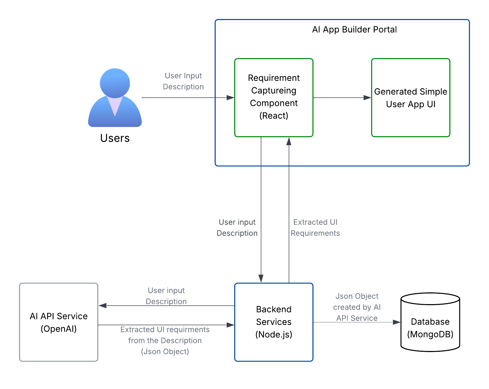

# Mini AI App Builder Portal

## Introduction

This project is a minimal AI-powered app-building portal developed as a prototype implementation. The portal enables users to describe the application they want to build, automatically captures those requirements, and uses an AI API to extract structured specifications. Based on these requirements, the system generates a simple mock user interface, basically a tabbed application form group, single form, tables, etc.  to demonstrate how AI-derived requirements can be translated into UI components.

This implementation focuses on demonstrating the end-to-end flow from natural language requirements to UI generation, with emphasis on clean structure, clear code, and an intuitive user experience.

---

## Features

* **Requirement capturing:** Users can enter free-text descriptions of their desired application.
* **AI-powered requirement extraction:** Integration with an AI API (OpenAI) to convert descriptions into structured UI requirements.
* **Mock UI generation:** Dynamically builds simple UI components *tabbed web application form group*, simple forms, tables, etc.) from extracted requirements. Note: Only the 'tabbed web application form group' is implemented at the moment.
* **Data persistence:** Extracted requirements and AI-generated meta-data to build web UI is stored in MongoDB for reference.

---

## System Design

The **AI App Builder Portal** follows a modular architecture that connects users, frontend components, backend services, an AI-powered API, and a database. The goal is to transform natural language input into a structured set of UI requirements and demonstrate those requirements as a mock user interface.

The design is illustrated in the following diagram:




Below clarifies the tasks of each component of the design.

### 1. Users

* End-users interact with the portal through a browser-based interface.
* They provide natural language descriptions of the application they want to build (e.g., *“I need a form with a name field and a submit button”*).

### 2. AI App Builder Portal (Frontend – React)

* The main entry point for user interaction.
* **Requirement Capturing Component (React):**

  * Accepts the user’s input description.
  * Sends the description to the backend for processing.
  * Provides an intuitive and simple UI for requirement submission.
* **Generated Simple User App UI:**

  * Displays a mock interface based on extracted requirements.
  * Dynamically renders forms, tables, or buttons to reflect the structured output received from the backend.
  * Demonstrates the translation of AI-derived requirements into UI components.

### 3. Backend Services (Node.js/Express)

* Acts as the middleware between the frontend, the AI API service, and the database.
* Responsibilities:

  * Receive user input descriptions from the frontend.
  * Forward the input to the AI API service.
  * Receive structured requirements (JSON format) from the AI API service.
  * Store these structured requirements in the MongoDB database.
  * Return the extracted requirements to the frontend for UI generation.

#### Exposed REST APIs

This backend service exposes below REST APIs.


**1. **POST `/api/parse`****

* **Purpose:**
  Takes a natural language description from the frontend, sends it to the OpenAI API, extracts structured requirements (App Name, Entities, Roles, Features, Mapping), cleans the mapping, saves part of the data into MongoDB, and returns the full result to the frontend.

* **Request Body Example:**

  ```json
  {
    "description": "I want an app to manage student courses and grades. Teachers add courses, students enrol, and admins manage reports."
  }
  ```

* **Response Example:**

  ```json
  {
    "App Name": "Course Management System",
    "Entities": ["Student", "Course", "Grade"],
    "Roles": ["Teacher", "Student", "Admin"],
    "Features": ["Add course", "Enroll student", "Manage reports"],
    "Mapping": {
      "Teacher": { "entity": "Course", "feature": "Add course", "fields": ["CourseID","Title","Code","Credits"] },
      "Student": { "entity": "Grade", "feature": "Enroll student", "fields": ["StudentID","CourseID","Score"] },
      "Admin": { "entity": "Student", "feature": "Manage reports", "fields": ["StudentID","Name","Email","Age"] }
    }
  }
  ```

**2. **CRUD endpoints under `/api/requirements`****

For managing requirement records in MongoDB. Please note that this is not implemented completely. This this is in-progress.

* **GET `/api/requirements`** – Fetch all requirement documents from MongoDB.
* **GET `/api/requirements/latest`** – Fetch the latest requirement.

### 4. AI API Service (OpenAI)

* Processes natural language descriptions submitted by users.
* Extracts **structured UI requirements** such as fields, tables, buttons, and layouts.
* Returns the requirements to the backend in JSON format.
* Example:

  * Input: *“I want an app to manage student courses and grades. Teachers add courses, students enrol, and admins manage reports.”*
  * Output JSON:

    ```json
    {
        "userInput": "I want an app to manage student courses and grades. Teachers add courses, students enrol, and admins manage reports.",
        "appName": "Course Management System",
        "entities": ["Student", "Course", "Grade"],
        "roles": ["Teacher", "Student", "Admin"],
        "features": ["Add course", "Enroll student", "Manage reports"],
        "_id": "68deef4abf4facf8110dea31",
        "createdAt": "2025-10-02T21:31:54.997Z",
        "__v": 0,
        "Mapping": {
            "Teacher": {
            "entity": "Course",
            "feature": "Add course",
            "fields": [
                "CourseID",
                "Title",
                "Code",
                "Credits"
            ]
            },
            "Student": {
            "entity": "Grade",
            "feature": "Enroll student",
            "fields": [
                "StudentID",
                "CourseID",
                "Score"
            ]
            },
            "Admin": {
            "entity": "Student",
            "feature": "Manage reports",
            "fields": [
                "StudentID",
                "Name",
                "Email",
                "Age"
            ]
            }
        }
    }

    ```

### 5. Database (MongoDB)

* Stores structured requirements generated by the AI API.
* Allows persistence of user input and generated JSON objects for later retrieval.
* Ensures that requirements can be reloaded and reused without reprocessing by the AI API.

### Workflow Summary

Below is how the workflow of the application align with the design of the system.

1. Users provide a description of the app they want.
2. The React frontend captures the description and sends it to the backend.
3. The backend forwards the description to the AI API service.
4. The AI API service extracts structured requirements and returns them as JSON.
5. The backend stores the JSON in MongoDB and sends it back to the frontend.
6. The frontend renders a mock UI based on the structured requirements.


This design ensures **clear separation of responsibilities**, **scalability**, and **proof-of-concept demonstration** of how natural language can drive UI generation.

----

## Tech Stack USed

* **Frontend:** React
* **Backend:** Node.js
* **Database:** MongoDB (MongoDB Atlas on cloud)
* **AI Integration:** OpenAI API
* **Other Tools:** npm

---

## How to Run

### 1. Prerequisites

* [Node.js](https://nodejs.org/) (v16+)
* [npm](https://www.npmjs.com/) or [yarn](https://yarnpkg.com/)
* [MongoDB](https://www.mongodb.com/) (MongoDB Atlas)
* An **OpenAI API Key**


### 2. Clone the Repository

```bash
git clone https://github.com/hsemini/ai-app-builder.git
cd ai-app-builder
```

### 3. Configure Environment Variables

Create a `.env` file inside the **backend** folder:

```env
MONGO_URI = <your_mongodb_uri_here>
OPENAI_API_KEY=<your_openai_api_key_here>

```

### 4. Install Dependencies

#### Backend

```bash
cd backend
npm install
```

#### Frontend

```bash
cd ../frontend
npm install
```

### 5. Start the Application

#### Start Backend

```bash
cd backend
npm run dev
```

#### Start Frontend

Open a new terminal:

```bash
cd frontend
npm run dev
```

### 6. Access the App

Open your browser and go to:

```
http://localhost:3000
```
---

## Future Improvements

* Add support for richer UI components (charts, navigation).
* Extend AI requirement extraction to cover workflows, not just UI elements.
* Add Docker Compose for easier setup (backend + frontend + MongoDB).

---

## License

This project is provided for evaluation purposes. You are free to fork and experiment with it.

---